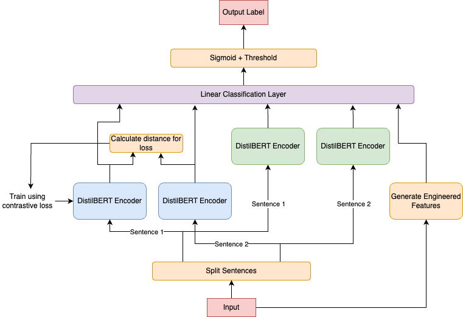

# Author Identity Classification

This repository contains the code for a dual encoder + fine-tuned LLM approach to author identity identification.

Requirements:
```
spacy==3.7.6
pandas
numpy
scikit-learn == 0.24.2
transformers == 4.31.0
huggingface-hub==0.26.2
torch == 2.4.1
scipy == 1.10.1
```

# Task

The task is to create a binary classifier which takes two sentences separated by a \[SNIPPET\] and classifies them as either 0 (not from the same author) or 1 (from the same author).

My approach to this task was to create a dual encoder[^1] architecture where each sentence is passed through the same DistilBERT network separately (not in the same run with the \[SEP\] token) and the sentence embedding is extracted (the embeddings of the \[CLS\] token). These two embeddings are measured for cosine similarity which is used to calculate the loss.

For this dual encoder architecture, I use contrastive loss as defined below:

$\mathcal{L}_{\text{contrastive}}(D, y) = (1 - y) \cdot (D + 1)^{2} + y \cdot \text{max}(D - 1)^{2}$

where:
* $D$ is the cosine similarity of $\vec{E}_1$ and $\vec{E}_2$ from DistilBERT
* $y$ is the gold label

This loss function is similar to cross-entropy loss, but has the objective of pushing embeddings of sentences from different authors further apart (toward -1) and embeddings of sentences from the same author closer together (toward 1). Thus, the DistilBERT model is fine-tuned to create an embedding space where the same author's work is clustered together, ideally capturing stylistic clusters.

This network is adapted from simple facial recognition systems which use dual encoders to train a system to classify two images as having the same face or not (though in that case Euclidean distance would generally be used).

Once the dual encoder is fine-tuned, the distance fine-tuned model is frozen and added to the pipeline of the final model. In the final model, sentences are fed through both the frozen dual encoder architecture and another DistilBERT model to generate semantic sentence embeddings for a final linear layer which takes the distance embeddings and semantic embeddings as input and 6 engineered features (discussed below) as input. This model is trained with binary cross-entropy loss, but the distance embeddings are frozen to retain the style embedding space. The architecture diagram is shown below:



Both models are trained with mini-batch gradient descent with an Adam optimizer. The dual encoder was trained with 20 epochs and a batch size of 32. The main layer was trained with 5 epochs and a batch size of 16. To deal with class imbalance and overfitting, the positive class was given a weight of 4.0 in the BNE loss calculation and weight decay was set 0.01.

I went with DistilBERT over other LLMs because it is faster, uses less memory (allows for larger batch size), and seems to generalize slightly better (further suggesting overfitting with two many parameters).

[^1]: Note: This is also called a "Siamese Network" if you have heard of that, but this term is insensitive, so I will use the term dual encoder for this writeup.

### Engineered Features

Based on my exploratory data analysis, I included 6 engineered features which come from 2 sources: the proportion of words that are nouns in the sentence and the proportion of words in the sentence which are not in the 5,000 most common words in English (which I call rarity in this writeup). The 6 features are:
 
* From noun proportion:
  * Noun proportion in sentence 1
  * Noun proportion in sentence 2
  * Difference in noun proportion between sentence 1 and 2
From rarity:
  * Rarity of sentence 1
  * Rarity of sentence 2
  * Difference in rarity between sentence 1 and 2

# Running the code

The primary script to run is train.py which can be run to replicate my current best model like so:

```
python3 train.py --batch_size_dual_encoder 32 --num_epochs_dual_encoder 20 --batch_size 16 --num_epochs 5 --positive_weight 4.0 --use_engineered_features --report_per_epoch --eval_test
```

To run the eval on the test data, run:

```
python3 predict.py --model_path path/to/your/model.pt --data_path path/to/your/test/data --use_engineered_features
```